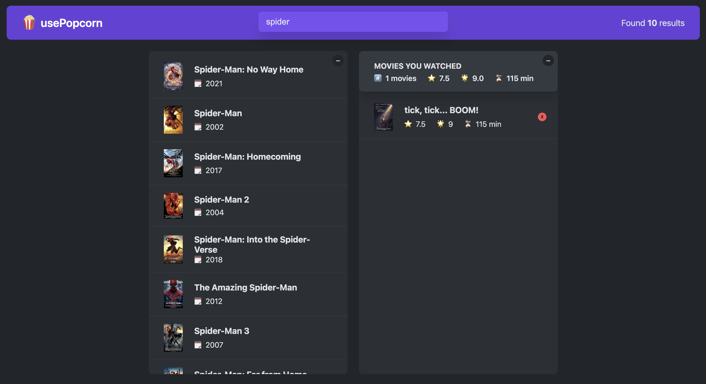

# usePopcorn

A movie search and watch-list app built with React, from **Jonas Schmedtmann's** _The Ultimate React Course_. It lets you search movies from the OMDb API, view details, rate them, and keep track of the movies you've watched.

**[Live Demo](https://usepopcorn-plum.vercel.app/)**

## Features

- **Live movie search** against the OMDb API as you type
- **Movie details view** – plot, cast, director, genre, runtime, and IMDb rating
- **Interactive star rating** (1–10) when adding a movie to your watched list
- **Watched list & summary** – total movies, average IMDb / user rating, and average runtime
- **Remove movies** from your watched list
- **Persistent storage** – watched movies are saved to `localStorage`
- **Keyboard shortcuts** – press `Escape` to close the movie details

## Tech Stack

- **React 18** – function components and hooks
- **Hooks** – `useState`, `useEffect`, `useRef`, and custom hooks (`useMovies`, `useLocalStorageState`, `useKey`)
- **OMDb API** – movie data source via `fetch`
- Built with **Create React App**

## What I Learned

- Managing state with React Hooks
- Using useEffect for data fetching
- Working with external APIs
- Creating custom hooks
- Handling loading and error states
- Managing keyboard events
- Working with refs using useRef
- Building reusable React components

## Credits

This project was built as part of the React course by Jonas Schmedtmann.
